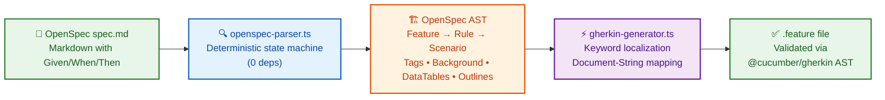
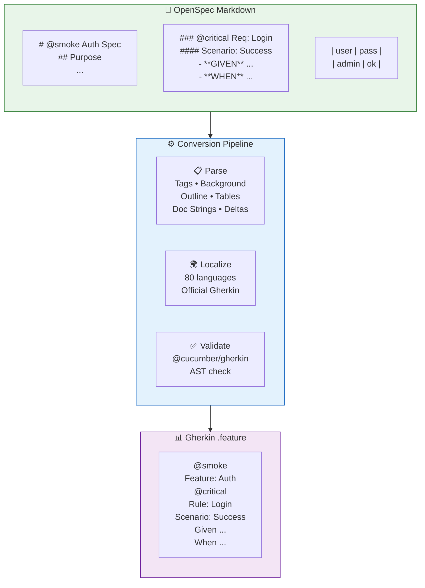

<p align="center">
  <picture>
    <source media="(prefers-color-scheme: dark)" srcset="https://raw.githubusercontent.com/neurono-ml/cucumber-openspec/main/assets/logo-dark.svg">
    
  </picture>
</p>

<p align="center">
  <b>OpenSpec → Gherkin converter • 80 languages • 0 runtime deps • deterministic</b>
</p>

<p align="center">
  <a href="https://skills.sh/neurono-ml/cucumber-openspec/cucumber-openspec"></a>
  <a href="https://github.com/neurono-ml/cucumber-openspec/actions/workflows/ci.yml"></a>
  <a href="https://neurono-ml.github.io/cucumber-openspec/"></a>
  <a href="./LICENSE"></a>
  
  
  
</p>

---

**cucumber-openspec** converts [OpenSpec](https://github.com/neurono-ml/openspec) behavior specifications (Markdown `spec.md` files) into strict [Cucumber](https://cucumber.io/)/Gherkin `.feature` files — with **zero AI dependencies**, a **deterministic state-machine parser**, and support for all **80 Gherkin languages**.

> **Read this document in other languages:**
> [Português Brasileiro](./README.pt-BR.md) &nbsp;|&nbsp; [简体中文](./README.zh-CN.md)

---

## 🚀 Quick Start

```bash
# Install the skill for your AI agent
npx skills add neurono-ml/cucumber-openspec

# Convert a directory of specs to Gherkin feature files
npx tsx scripts/index.ts -i ./openspec -o ./features

# Convert with Portuguese Gherkin keywords
npx tsx scripts/index.ts -i ./openspec -o ./features -l pt

# Convert a single spec file
npx tsx scripts/index.ts -i openspec/specs/auth/spec.md -o ./features
```

**Output path convention:**

| Input | Output |
|---|---|
| `openspec/specs/auth/spec.md` | `features/auth.feature` |
| `openspec/changes/my-change/specs/auth/spec.md` | `features/my-change_auth.feature` |

---

## 💡 Why cucumber-openspec?

| Challenge | Solution |
|---|---|
| **Writing Gherkin by hand is tedious** | Write concise Markdown specs — generate `.feature` files instantly |
| **AI-generated Gherkin is unreliable** | 0% AI dependency — deterministic parser gives the same output every time |
| **Multi-language teams** | All 80 Gherkin languages built in — no manual translation |
| **Change management** | Delta sections (`ADDED`/`MODIFIED`/`REMOVED`) map directly to Gherkin annotations |
| **Continuous integration** | Run the converter in CI — specs become living documentation |
| **No runtime bloat** | Pure TypeScript, zero npm dependencies at runtime |

---

## ⚙️ How It Works





---

## ✨ Feature Showcase

### Tags — at Feature, Rule, and Scenario level

```markdown
# @smoke @regression Auth Specification
### @critical Requirement: Login
#### @slow Scenario: Session Timeout
- **GIVEN** an active session
- **WHEN** 30 minutes pass
- **THEN** the session expires
```

```gherkin
@smoke @regression
Feature: Auth

  @critical
  Rule: Login

    @slow
    Scenario: Session Timeout
      Given an active session
      When 30 minutes pass
      Then the session expires
```

### Background — shared setup steps

```markdown
## Background
- **GIVEN** an authenticated admin user
- **AND** the user has admin privileges
```

```gherkin
  Background:
    Given an authenticated admin user
    And the user has admin privileges
```

### Scenario Outline + Examples — data-driven testing

```markdown
#### Scenario Outline: Login with roles
- **GIVEN** user is <role>
- **WHEN** login is attempted
- **THEN** access is <status>

##### Examples:
| role  | status  |
| admin | granted |
| guest | denied  |
```

```gherkin
    Scenario Outline: Login with roles
      Given user is <role>
      When login is attempted
      Then access is <status>

      Examples:
        | role  | status  |
        | admin | granted |
        | guest | denied  |
```

### DataTables — tabular data under any step

```markdown
- **GIVEN** the following users exist:
  | name  | email             | role   |
  | Alice | alice@example.com | admin  |
  | Bob   | bob@example.com   | viewer |
- **WHEN** bulk import is executed
- **THEN** all users are created
```

```gherkin
      Given the following users exist:
        | name  | email             | role   |
        | Alice | alice@example.com | admin  |
        | Bob   | bob@example.com   | viewer |
      When bulk import is executed
      Then all users are created
```

### Doc Strings — sub-bullets to `"""` blocks

```markdown
- **THEN** the system returns a response
  - status: 200
  - body includes token
  - expires in 3600 seconds
```

```gherkin
      Then the system returns a response
        """
        status: 200
        body includes token
        expires in 3600 seconds
        """
```

### Delta Specs — manage change over time

```markdown
## ADDED Requirements
### Requirement: Biometric Login
- **GIVEN** a registered fingerprint
- **WHEN** user scans fingerprint
- **THEN** access is granted

## REMOVED Requirements
### Requirement: SMS OTP
Deprecated in favor of biometric auth.
```

```gherkin
  Rule: Biometric Login
    # ADDED
    Scenario: Fingerprint Auth
      Given a registered fingerprint
      When user scans fingerprint
      Then access is granted

  Rule: SMS OTP
    Deprecated in favor of biometric auth.
    # REMOVED: SMS OTP — Deprecated...
```

---

## 🌍 Localization — 80 Gherkin Languages

```bash
# Portuguese
npx tsx scripts/index.ts -i ./openspec -o ./features -l pt

# Japanese
npx tsx scripts/index.ts -i ./openspec -o ./features -l ja

# Arabic (RTL)
npx tsx scripts/index.ts -i ./openspec -o ./features -l ar

# Chinese Simplified
npx tsx scripts/index.ts -i ./openspec -o ./features -l zh-CN
```

**Example output in Portuguese:**
```gherkin
# language: pt
Funcionalidade: Autenticação

  Contexto:
    Dado que o usuário está logado

  Regra: Login
    Cenário: Login bem-sucedido
      Dado um usuário registrado com credenciais válidas
      Quando ele enviar email e senha
      Então recebe um token JWT
```

**Example output in Chinese:**
```gherkin
# language: zh-CN
功能: 用户登录

  背景:
    假如用户已登录

  规则: 登录
    场景: 登录成功
      假如用户使用有效凭证
      当用户提交邮箱和密码
      那么用户收到 JWT 令牌
```

---

## 📦 Installation Options

| Method | Command |
|---|---|
| **AI Agent Skill** | `npx skills add neurono-ml/cucumber-openspec` |
| **Git Clone** | `git clone https://github.com/neurono-ml/cucumber-openspec.git` |
| **npm** | `npm install` (for CI pipelines — no runtime deps) |

**Requirements:** Node.js 20+ and `npx` (ships with npm).

---

## 📊 Project Stats

```
📁 8 test files      ✅ 92 tests passing
🌐 80 languages      ⚡ 0 runtime dependencies
📄 15 test suites    🧪 Validated via @cucumber/gherkin AST
```

---

## 🧪 Running Tests

```bash
# Full test suite
npm test

# With coverage
node --experimental-test-coverage --test tests/*.test.ts
```

---

## 📖 Full Documentation

Complete documentation is available as an **mdBook** in 3 languages:

| Language | Link |
|---|---|
| 🇺🇸 English | [docs](https://neurono-ml.github.io/cucumber-openspec/en/) |
| 🇧🇷 Portuguese | [documentação](https://neurono-ml.github.io/cucumber-openspec/pt-BR/) |
| 🇨🇳 Chinese | [文档](https://neurono-ml.github.io/cucumber-openspec/zh-CN/) |

Covers: installation, usage, each feature in depth, 80-language reference, development guide, and Cucumber tools by language.

---

## 🤝 Contributing

Contributions are welcome! See the [Development Guide](https://neurono-ml.github.io/cucumber-openspec/en/development.html).

**Key points:**
- Maintain **page parity** across all 3 documentation languages
- All output must pass `@cucumber/gherkin` AST validation
- Keep the parser **deterministic** — no AI or non-deterministic logic

---

## ⭐ Support

If you find this tool useful, please **star the repository** ⭐ on GitHub — it helps others discover it!

[](https://github.com/neurono-ml/cucumber-openspec)

---

## 📚 References

- [OpenSpec Specification](https://github.com/neurono-ml/openspec) — the Markdown spec format
- [Cucumber](https://cucumber.io/) — BDD framework that consumes Gherkin `.feature` files
- [Gherkin Reference](https://cucumber.io/docs/gherkin/reference/) — official Gherkin syntax
- [skills.sh](https://skills.sh/) — installable AI agent skills
- [@cucumber/gherkin](https://github.com/cucumber/cucumber/tree/main/gherkin) — official Gherkin parser (used for validation)
- [mdBook](https://rust-lang.github.io/mdBook/) — documentation framework

---

<p align="center">
  <sub>Built with ❤️ by <a href="https://github.com/neurono-ml">neurono-ml</a> • MIT Licensed</sub>
</p>
