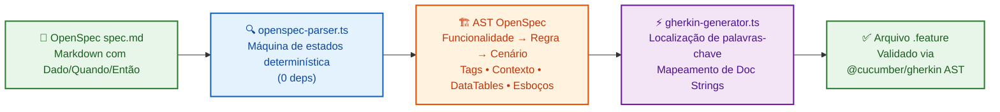
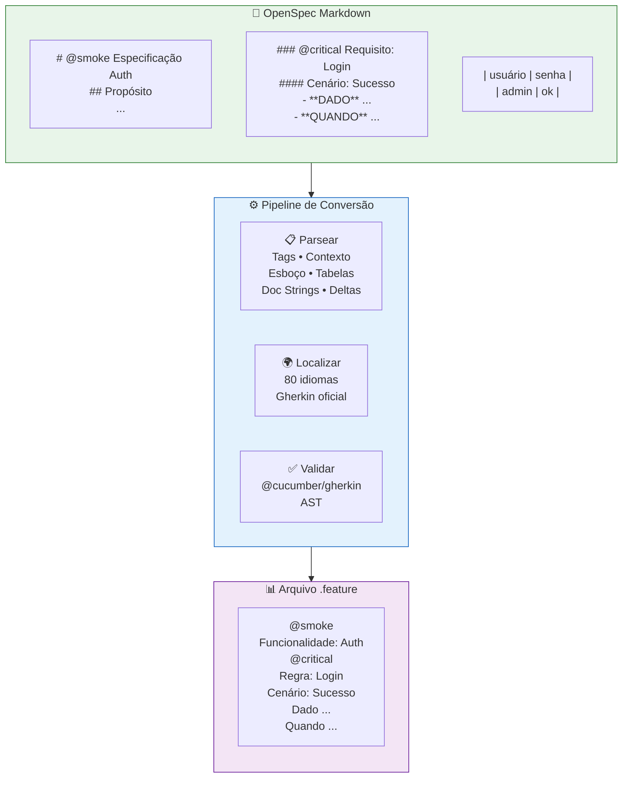

<p align="center">
  
</p>

<p align="center">
  <b>Conversor OpenSpec → Gherkin • 80 idiomas • 0 dependências em runtime • determinístico</b>
</p>

<p align="center">
  <a href="https://skills.sh/neurono-ml/cucumber-openspec/cucumber-openspec"></a>
  <a href="https://github.com/neurono-ml/cucumber-openspec/actions/workflows/ci.yml"></a>
  <a href="https://neurono-ml.github.io/cucumber-openspec/"></a>
  <a href="./LICENSE"></a>
  
  
  
</p>

---

**cucumber-openspec** converte especificações de comportamento [OpenSpec](https://github.com/neurono-ml/openspec) (arquivos `spec.md` em Markdown) em arquivos `.feature` [Cucumber](https://cucumber.io/)/Gherkin válidos — com **zero dependência de IA**, um **parser determinístico baseado em máquina de estados** e suporte a todos os **80 idiomas do Gherkin**.

> **Leia este documento em outros idiomas:**
> [English](./README.md) &nbsp;|&nbsp; [简体中文](./README.zh-CN.md)

---

## 🚀 Começo Rápido

```bash
# Instale a skill para seu agente de IA
npx skills add neurono-ml/cucumber-openspec

# Converta um diretório de specs para arquivos .feature
npx tsx scripts/index.ts -i ./openspec -o ./features

# Converta com palavras-chave em português
npx tsx scripts/index.ts -i ./openspec -o ./features -l pt

# Converta um único arquivo spec
npx tsx scripts/index.ts -i openspec/specs/auth/spec.md -o ./features
```

**Convenção de caminhos de saída:**

| Entrada | Saída |
|---|---|
| `openspec/specs/auth/spec.md` | `features/auth.feature` |
| `openspec/changes/minha-alteracao/specs/auth/spec.md` | `features/minha-alteracao_auth.feature` |

---

## 💡 Por que usar cucumber-openspec?

| Desafio | Solução |
|---|---|
| **Escrever Gherkin manualmente é tedioso** | Escreva specs concisas em Markdown — gere arquivos `.feature` instantaneamente |
| **Gherkin gerado por IA é não confiável** | 0% de dependência de IA — parser determinístico produz o mesmo resultado sempre |
| **Equipes multilíngues** | Todos os 80 idiomas Gherkin embutidos — sem tradução manual |
| **Gestão de mudanças** | Seções delta (`ADDED`/`MODIFIED`/`REMOVED`) mapeadas diretamente para anotações Gherkin |
| **Integração contínua** | Execute o conversor na CI — especificações viram documentação viva |
| **Sem inchaço de runtime** | TypeScript puro, zero dependências npm em runtime |

---

## ⚙️ Como Funciona





---

## ✨ Demonstração de Recursos

### Tags — nos níveis Funcionalidade, Regra e Cenário

```markdown
# @smoke @regression Especificação Auth
### @critical Requisito: Login
#### @lento Cenário: Timeout de Sessão
- **DADO** uma sessão ativa
- **QUANDO** 30 minutos se passarem
- **ENTÃO** a sessão expira
```

```gherkin
@smoke @regression
Funcionalidade: Auth

  @critical
  Regra: Login

    @lento
    Cenário: Timeout de Sessão
      Dado uma sessão ativa
      Quando 30 minutos se passarem
      Então a sessão expira
```

### Contexto (Background) — etapas compartilhadas

```markdown
## Background
- **DADO** um usuário admin autenticado
- **E** o usuário tem privilégios de admin
```

```gherkin
  Contexto:
    Dado um usuário admin autenticado
    E o usuário tem privilégios de admin
```

### Esquema do Cenário + Exemplos — testes orientados a dados

```markdown
#### Esquema do Cenário: Login com perfis
- **DADO** que o usuário é <perfil>
- **QUANDO** o login é tentado
- **ENTÃO** o acesso é <status>

##### Exemplos:
| perfil | status   |
| admin  | concedido|
| convidado | negado|
```

```gherkin
    Esquema do Cenário: Login com perfis
      Dado que o usuário é <perfil>
      Quando o login é tentado
      Então o acesso é <status>

      Exemplos:
        | perfil    | status     |
        | admin     | concedido  |
        | convidado | negado     |
```

### DataTables — dados tabulares sob qualquer etapa

```markdown
- **DADO** que os seguintes usuários existem:
  | nome  | email             | função |
  | Alice | alice@exemplo.com | admin  |
  | Bob   | bob@exemplo.com   | viewer |
- **QUANDO** a importação em massa é executada
- **ENTÃO** todos os usuários são criados
```

```gherkin
      Dado que os seguintes usuários existem:
        | nome  | email             | função |
        | Alice | alice@exemplo.com | admin  |
        | Bob   | bob@exemplo.com   | viewer |
      Quando a importação em massa é executada
      Então todos os usuários são criados
```

### Doc Strings — sub-itens para blocos `"""`

```markdown
- **ENTÃO** o sistema retorna uma resposta
  - status: 200
  - corpo inclui token
  - expira em 3600 segundos
```

```gherkin
      Então o sistema retorna uma resposta
        """
        status: 200
        corpo inclui token
        expira em 3600 segundos
        """
```

### Especificações Delta — gerencie mudanças ao longo do tempo

```markdown
## ADDED Requirements
### Requisito: Login Biométrico
- **DADO** uma impressão digital registrada
- **QUANDO** o usuário escaneia a digital
- **ENTÃO** o acesso é concedido

## REMOVED Requirements
### Requisito: SMS OTP
Depreciado em favor de autenticação biométrica.
```

```gherkin
  Regra: Login Biométrico
    # ADICIONADO
    Cenário: Autenticação por Digital
      Dado uma impressão digital registrada
      Quando o usuário escaneia a digital
      Então o acesso é concedido

  Regra: SMS OTP
    Depreciado em favor de autenticação biométrica.
    # REMOVIDO: SMS OTP — Depreciado...
```

---

## 🌍 Localização — 80 Idiomas Gherkin

```bash
# Inglês (padrão)
npx tsx scripts/index.ts -i ./openspec -o ./features

# Português
npx tsx scripts/index.ts -i ./openspec -o ./features -l pt

# Japonês
npx tsx scripts/index.ts -i ./openspec -o ./features -l ja

# Árabe (RTL)
npx tsx scripts/index.ts -i ./openspec -o ./features -l ar

# Chinês Simplificado
npx tsx scripts/index.ts -i ./openspec -o ./features -l zh-CN
```

**Exemplo de saída em português:**
```gherkin
# language: pt
Funcionalidade: Autenticação

  Contexto:
    Dado que o usuário está logado

  Regra: Login
    Cenário: Login bem-sucedido
      Dado um usuário registrado com credenciais válidas
      Quando ele enviar email e senha
      Então recebe um token JWT
```

**Exemplo de saída em chinês:**
```gherkin
# language: zh-CN
功能: 用户登录

  背景:
    假如用户已登录

  规则: 登录
    场景: 登录成功
      假如用户使用有效凭证
      当用户提交邮箱和密码
      那么用户收到 JWT 令牌
```

---

## 📦 Opções de Instalação

| Método | Comando |
|---|---|
| **Skill para Agente de IA** | `npx skills add neurono-ml/cucumber-openspec` |
| **Git Clone** | `git clone https://github.com/neurono-ml/cucumber-openspec.git` |
| **npm** | `npm install` (para pipelines CI — sem deps em runtime) |

**Requisitos:** Node.js 20+ e `npx` (incluído com npm).

---

## 📊 Estatísticas do Projeto

```
📁 8 arquivos de teste    ✅ 92 testes aprovados
🌐 80 idiomas             ⚡ 0 dependências em runtime
📄 15 suites de teste     🧪 Validados via @cucumber/gherkin AST
```

---

## 🧪 Executando Testes

```bash
# Suíte completa
npm test

# Com cobertura
node --experimental-test-coverage --test tests/*.test.ts
```

---

## 📖 Documentação Completa

A documentação completa está disponível como **mdBook** em 3 idiomas:

| Idioma | Link |
|---|---|
| 🇺🇸 Inglês | [docs](https://neurono-ml.github.io/cucumber-openspec/en/) |
| 🇧🇷 Português | [documentação](https://neurono-ml.github.io/cucumber-openspec/pt-BR/) |
| 🇨🇳 Chinês | [文档](https://neurono-ml.github.io/cucumber-openspec/zh-CN/) |

Cobre: instalação, uso, cada recurso em detalhes, referência de 80 idiomas, guia de desenvolvimento e ferramentas Cucumber por idioma.

---

## 🤝 Contribuindo

Contribuições são bem-vindas! Veja o [Guia de Desenvolvimento](https://neurono-ml.github.io/cucumber-openspec/pt-BR/development.html).

**Pontos importantes:**
- Mantenha a **paridade de páginas** entre os 3 idiomas da documentação
- Toda saída deve passar pela validação AST do `@cucumber/gherkin`
- Mantenha o parser **determinístico** — sem IA ou lógica não determinística

---

## ⭐ Apoie

Se você achar esta ferramenta útil, por favor **dê uma estrela no repositório** ⭐ no GitHub — isso ajuda outras pessoas a descobri-la!

[](https://github.com/neurono-ml/cucumber-openspec)

---

## 📚 Referências

- [Especificação OpenSpec](https://github.com/neurono-ml/openspec) — o formato de especificação Markdown
- [Cucumber](https://cucumber.io/) — framework BDD que consome arquivos `.feature` do Gherkin
- [Referência Gherkin](https://cucumber.io/docs/gherkin/reference/) — sintaxe oficial do Gherkin
- [skills.sh](https://skills.sh/) — skills instaláveis para agentes de IA
- [@cucumber/gherkin](https://github.com/cucumber/cucumber/tree/main/gherkin) — parser Gherkin oficial (usado para validação)
- [mdBook](https://rust-lang.github.io/mdBook/) — framework de documentação

---

<p align="center">
  <sub>Feito com ❤️ por <a href="https://github.com/neurono-ml">neurono-ml</a> • Licença MIT</sub>
</p>
