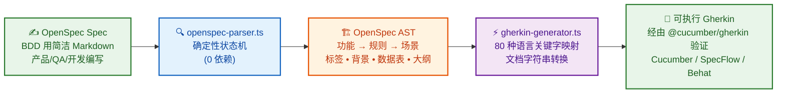
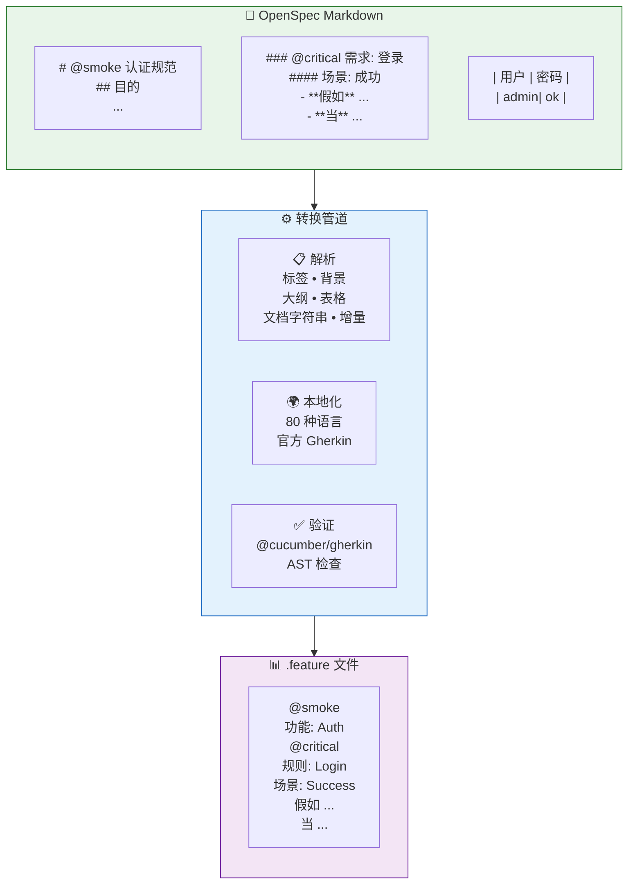

<p align="center">
  
</p>

<p align="center">
  <b>OpenSpec → Gherkin 转换器 • 80 种语言 • 零运行时依赖 • 确定性解析</b>
</p>

<p align="center">
  <a href="https://skills.sh/neurono-ml/cucumber-openspec/cucumber-openspec"></a>
  <a href="https://github.com/neurono-ml/cucumber-openspec/actions/workflows/ci.yml"></a>
  <a href="https://neurono-ml.github.io/cucumber-openspec/"></a>
  <a href="./LICENSE"></a>
  
  
  
</p>

---

**cucumber-openspec** 连接了[行为驱动开发](https://cucumber.io/docs/bdd/)（BDD）的两端：

- **🖊️ 编写** [OpenSpec](https://github.com/neurono-ml/openspec) 行为规范——一种简单、人类可读的 Markdown 格式，产品经理、QA 和开发人员都可以共同参与
- **⚡ 转换** 为严格的 [Cucumber](https://cucumber.io/)/Gherkin `.feature` 文件——**零 AI 依赖**，使用**确定性状态机解析器**，支持全部 **80 种 Gherkin 语言**

结果？**一份 BDD 规范，两种格式。** 团队用简洁的 Markdown 编写和评审；自动化工具在 Cucumber、SpecFlow、Behave 或任何 BDD 框架中运行生成的 Gherkin。

> **🌐 语言**
>
> [](./README.md)
> [](./README.pt-BR.md)
> [](./README.zh-CN.md)

---

## 🚀 快速开始

```bash
# 为 AI 代理安装技能
npx skills add neurono-ml/cucumber-openspec

# 将规范目录转换为 Gherkin 功能文件
npx tsx scripts/index.ts -i ./openspec -o ./features

# 转换为中文 Gherkin 关键字
npx tsx scripts/index.ts -i ./openspec -o ./features -l zh-CN

# 转换单个规范文件
npx tsx scripts/index.ts -i openspec/specs/auth/spec.md -o ./features
```

**输出路径约定：**

| 输入 | 输出 |
|---|---|
| `openspec/specs/auth/spec.md` | `features/auth.feature` |
| `openspec/changes/my-change/specs/auth/spec.md` | `features/my-change_auth.feature` |

---

## 💡 为什么选择 cucumber-openspec？

### 可扩展的 BDD 工作流

BDD 承诺产品、开发和 QA 之间的协作——但大多数团队会遇到一个障碍：**Gherkin `.feature` 文件是唯一的事实来源，但它们难以协作编写。** cucumber-openspec 通过将 [OpenSpec](https://github.com/neurono-ml/openspec) 作为源头、Gherkin 作为生成的输出来解决这个问题。

```
OpenSpec (Markdown)  ──→  cucumber-openspec  ──→  Gherkin (.feature)
     ↑                                                   ↓
产品 / QA / 开发人员在这里编写           Cucumber / SpecFlow / Behat 在这里运行
```

关键洞察：**OpenSpec 是 Markdown 的面向测试的超集。** 它读起来像设计文档，但可以 1:1 映射到 Gherkin 结构。非开发人员编写规范；开发人员获得可执行的测试。无需手动处理 `.feature` 语法。

### 为什么首选 OpenSpec？

| 痛点 | OpenSpec 优先的方法 |
|---|---|
| **Gherkin 语法冗长且易出错** | OpenSpec 是简洁的 Markdown——编写列表项，而不是 `Feature:`/`Scenario:` 关键字 |
| **非开发人员无法编写 `.feature` 文件** | 任何了解 Markdown 的人都可以编写 OpenSpec 规范 |
| **规范和测试逐渐脱节** | OpenSpec 就是源头——Gherkin 始终从中重新生成 |
| **AI 生成的 Gherkin 会产生幻觉** | 0% AI——确定性解析器每次输出相同结果 |
| **多语言团队** | 用英文编写规范，生成所有 80 种语言的 Gherkin |
| **规范随时间演变** | 内置 ADDED/MODIFIED/REMOVED 增量章节 |
| **零运行时臃肿** | 纯 TypeScript，运行时零 npm 依赖 |

---

## ⚙️ 工作原理





---

## ✨ 功能展示

### 标签 — 功能、规则和场景级别

```markdown
# @smoke @regression 认证规范
### @critical 需求: 登录
#### @slow 场景: 会话超时
- **假如** 存在活跃会话
- **当** 30 分钟过去
- **那么** 会话过期
```

```gherkin
@smoke @regression
功能: Auth

  @critical
  规则: Login

    @slow
    场景: 会话超时
      假如 存在活跃会话
      当 30 分钟过去
      那么 会话过期
```

### 背景 — 共享设置步骤

```markdown
## 背景
- **假如** 已通过管理员身份认证
- **并且** 用户具有管理员权限
```

```gherkin
  背景:
    假如 已通过管理员身份认证
    并且 用户具有管理员权限
```

### 场景大纲 + 示例 — 数据驱动测试

```markdown
#### 场景大纲: 不同角色登录
- **假如** 用户是 <角色>
- **当** 尝试登录
- **那么** 访问状态为 <状态>

##### 示例:
| 角色   | 状态     |
| admin  | 已授权   |
| guest  | 已拒绝   |
```

```gherkin
    场景大纲: 不同角色登录
      假如 用户是 <角色>
      当 尝试登录
      那么 访问状态为 <状态>

      示例:
        | 角色   | 状态     |
        | admin  | 已授权   |
        | guest  | 已拒绝   |
```

### 数据表格 — 步骤下的表格数据

```markdown
- **假如** 系统中存在以下用户：
  | 姓名  | 邮箱              | 角色   |
  | Alice | alice@example.com | admin  |
  | Bob   | bob@example.com   | viewer |
- **当** 执行批量导入
- **那么** 所有用户被创建
```

```gherkin
      假如 系统中存在以下用户：
        | 姓名  | 邮箱              | 角色   |
        | Alice | alice@example.com | admin  |
        | Bob   | bob@example.com   | viewer |
      当 执行批量导入
      那么 所有用户被创建
```

### 文档字符串 — 子项目转换为 `"""` 块

```markdown
- **那么** 系统返回响应
  - 状态: 200
  - 响应体包含令牌
  - 3600 秒后过期
```

```gherkin
      那么 系统返回响应
        """
        状态: 200
        响应体包含令牌
        3600 秒后过期
        """
```

### 增量规范 — 管理随时间的变化

```markdown
## ADDED Requirements
### 需求: 生物识别登录
- **假如** 已注册指纹
- **当** 用户扫描指纹
- **那么** 授权通过

## REMOVED Requirements
### 需求: SMS 验证码
已弃用，改用生物识别认证。
```

```gherkin
  规则: 生物识别登录
    # 已添加
    场景: 指纹认证
      假如 已注册指纹
      当 用户扫描指纹
      那么 授权通过

  规则: SMS 验证码
    已弃用，改用生物识别认证。
    # 已移除: SMS 验证码 — 已弃用...
```

---

## 🌍 本地化 — 80 种 Gherkin 语言

```bash
# 英语（默认）
npx tsx scripts/index.ts -i ./openspec -o ./features

# 葡萄牙语
npx tsx scripts/index.ts -i ./openspec -o ./features -l pt

# 日语
npx tsx scripts/index.ts -i ./openspec -o ./features -l ja

# 阿拉伯语（RTL）
npx tsx scripts/index.ts -i ./openspec -o ./features -l ar

# 简体中文
npx tsx scripts/index.ts -i ./openspec -o ./features -l zh-CN
```

**中文输出示例：**
```gherkin
# language: zh-CN
功能: 用户登录

  背景:
    假如 用户已登录

  规则: 登录
    场景: 登录成功
      假如 用户使用有效凭证
      当 用户提交邮箱和密码
      那么 用户收到 JWT 令牌
```

**葡萄牙语输出示例：**
```gherkin
# language: pt
Funcionalidade: Autenticação

  Contexto:
    Dado que o usuário está logado

  Regra: Login
    Cenário: Login bem-sucedido
      Dado um usuário registrado com credenciais válidas
      Quando ele enviar email e senha
      Então recebe um token JWT
```

---

## 📦 安装方式

| 方法 | 命令 |
|---|---|
| **AI 代理技能** | `npx skills add neurono-ml/cucumber-openspec` |
| **Git 克隆** | `git clone https://github.com/neurono-ml/cucumber-openspec.git` |
| **npm** | `npm install`（适用于 CI 管道 —— 无运行时依赖） |

**系统要求：** Node.js 20+ 和 `npx`（随 npm 一起提供）。

---

## 📊 项目统计

```
📁 8 个测试文件       ✅ 92 个测试全部通过
🌐 80 种语言         ⚡ 0 个运行时依赖
📄 15 个测试套件     🧪 通过 @cucumber/gherkin AST 验证
```

---

## 🧪 运行测试

```bash
# 完整测试套件
npm test

# 带覆盖率
node --experimental-test-coverage --test tests/*.test.ts
```

---

## 📖 完整文档

完整文档以 **mdBook** 形式提供，支持 3 种语言：

| 语言 | 链接 |
|---|---|
| 🇺🇸 英语 | [docs](https://neurono-ml.github.io/cucumber-openspec/en/) |
| 🇧🇷 葡萄牙语 | [documentação](https://neurono-ml.github.io/cucumber-openspec/pt-BR/) |
| 🇨🇳 简体中文 | [文档](https://neurono-ml.github.io/cucumber-openspec/zh-CN/) |

涵盖：安装、使用、各功能的详细介绍、80 种语言参考、开发指南以及按语言分类的 Cucumber 工具。

---

## 🤝 参与贡献

欢迎贡献！请参阅[开发指南](https://neurono-ml.github.io/cucumber-openspec/zh-CN/development.html)。

**关键要求：**
- 在所有 3 种文档语言之间保持**页面奇偶性**
- 所有输出必须通过 `@cucumber/gherkin` AST 验证
- 保持解析器的**确定性**——不使用 AI 或非确定性逻辑

---

## ⭐ 支持

如果您觉得这个工具有用，请在 GitHub 上**给仓库点星** ⭐ —— 这有助于其他人发现它！

[](https://github.com/neurono-ml/cucumber-openspec)

---

## 📚 参考资料

- [OpenSpec 规范](https://github.com/neurono-ml/openspec) —— Markdown 规范格式
- [Cucumber](https://cucumber.io/) —— 消费 Gherkin `.feature` 文件的 BDD 框架
- [Gherkin 参考](https://cucumber.io/docs/gherkin/reference/) —— 官方 Gherkin 语法
- [skills.sh](https://skills.sh/) —— 可安装的 AI 代理技能
- [@cucumber/gherkin](https://github.com/cucumber/cucumber/tree/main/gherkin) —— 官方 Gherkin 解析器（用于验证）
- [mdBook](https://rust-lang.github.io/mdBook/) —— 文档框架

---

<p align="center">
  <sub>由 <a href="https://github.com/neurono-ml">neurono-ml</a> 用 ❤️ 构建 • MIT 许可证</sub>
</p>
