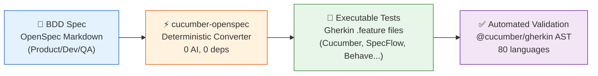
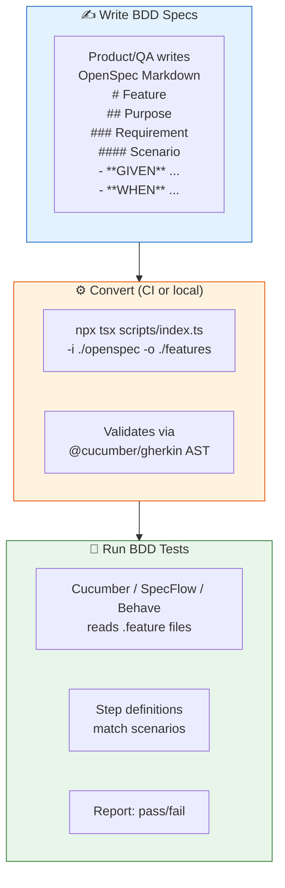

# cucumber-openspec

**Bridge the gap between BDD specifications and automated testing.**

cucumber-openspec converts [OpenSpec](https://github.com/neurono-ml/openspec) `spec.md` files — behavior specifications written in Given/When/Then Markdown — into strict, production-ready [Cucumber](https://cucumber.io/) / Gherkin `.feature` files.

It uses **zero-AI, deterministic TypeScript** (a state-machine parser + multi-language generator) to produce correct `.feature` files in any of the **[80 Gherkin languages](https://neurono-ml.github.io/cucumber-openspec/en/features/localization.html)**. No runtime dependencies beyond Node.js.

---

## 🧪 BDD-Focused: From Spec to Executable Tests

Behavior-Driven Development (BDD) works best when everyone — product, dev, QA — writes specifications in a shared language. This skill completes the BDD loop:



### Why this matters for BDD teams

| BDD Challenge | How cucumber-openspec solves it |
|---|---|
| **Specs live outside tests** | Specs ARE the source — generate `.feature` files directly from them |
| **Gherkin is verbose to write by hand** | Write concise Markdown, generate valid Gherkin instantly |
| **AI-generated Gherkin is non-deterministic** | 0% AI — same input always produces the same output |
| **Multi-language teams** | 80 Gherkin languages built in; team writes in their own language |
| **Specs drift from tests** | Run the converter in CI — specs become the single source of truth |
| **Change management is hard** | Delta sections (`ADDED`/`MODIFIED`/`REMOVED`) map to Gherkin annotations |

---

## 🔄 BDD Workflow



---

## 🚀 Quick Start

```bash
# Install the skill for your AI agent
npx skills add neurono-ml/cucumber-openspec

# Convert an entire BDD spec directory to Gherkin feature files
npx tsx scripts/index.ts -i ./openspec -o ./features

# Convert with Portuguese Gherkin keywords (Dado/Quando/Então)
npx tsx scripts/index.ts -i ./openspec -o ./features -l pt

# Convert a single spec file
npx tsx scripts/index.ts -i openspec/specs/auth/spec.md -o ./features
```

### Output paths

| Input | Output |
|---|---|
| `openspec/specs/<domain>/spec.md` | `features/<domain>.feature` |
| `openspec/changes/<change>/specs/<domain>/spec.md` | `features/<change>_<domain>.feature` |

### CLI options

| Flag | Description | Default |
|---|---|---|
| `-i, --input` | Path to openspec dir or spec.md file | **(required)** |
| `-o, --output` | Output directory | `./features` |
| `-l, --language` | Gherkin language code (e.g. `pt`, `ja`, `zh-CN`) | `en` |

---

## 📋 BDD Feature Mapping

| OpenSpec Markdown | Gherkin .feature | BDD Concept |
|---|---|---|
| `# @tag Feature` | `@tag` + `Feature:` | Business capability |
| `## Purpose` | Free-form description | Business value |
| `## Background` | `Background:` | Shared test context |
| `### @tag Requirement: Name` | `@tag` + `Rule: Name` | Business rule |
| `#### Scenario: Name` | `Scenario: Name` | Concrete example |
| `#### Scenario Outline: Name` | `Scenario Outline: Name` | Parameterized example |
| `- **GIVEN** state` | `Given state` | Precondition |
| `- **WHEN** action` | `When action` | Trigger |
| `- **THEN** outcome` | `Then outcome` | Expected result |
| `- **AND** ...` | `And ...` | Conjunction |
| `- **BUT** ...` | `But ...` | Negation |
| `  \| col \| col \|` (indented) | DataTable | Tabular test data |
| `- **GIVEN** ...` + sub-bullets | `"""` Doc String | Multi-line data |
| `##### Examples:` | `Examples:` | Data table for Outline |
| `## ADDED Requirements` | Rule + `# ADDED` | New behavior |
| `## MODIFIED Requirements` | Rule + `# MODIFIED note` | Changed behavior |
| `## REMOVED Requirements` | Rule + removal body text | Deprecated behavior |

---

## ✨ Feature Examples

### Tags at Feature, Rule, and Scenario level

```markdown
# @smoke @regression Auth Specification
### @critical Requirement: Login
#### @slow Scenario: Session Timeout
- **GIVEN** an active session
- **WHEN** 30 minutes pass
- **THEN** the session expires
```

```gherkin
@smoke @regression
Feature: Auth

  @critical
  Rule: Login

    @slow
    Scenario: Session Timeout
      Given an active session
      When 30 minutes pass
      Then the session expires
```

### Background — shared BDD context

```markdown
## Background
- **GIVEN** an authenticated admin user
- **AND** the user has admin privileges
```

```gherkin
  Background:
    Given an authenticated admin user
    And the user has admin privileges
```

### Scenario Outline — data-driven BDD

```markdown
#### Scenario Outline: Login with roles
- **GIVEN** user is <role>
- **WHEN** login is attempted
- **THEN** access is <status>

##### Examples:
| role  | status  |
| admin | granted |
| guest | denied  |
```

```gherkin
    Scenario Outline: Login with roles
      Given user is <role>
      When login is attempted
      Then access is <status>

      Examples:
        | role  | status  |
        | admin | granted |
        | guest | denied  |
```

### DataTables — tabular test data

```markdown
- **GIVEN** the following users exist:
  | name  | email             | role   |
  | Alice | alice@example.com | admin  |
  | Bob   | bob@example.com   | viewer |
- **WHEN** bulk import is executed
- **THEN** all users are created
```

```gherkin
      Given the following users exist:
        | name  | email             | role   |
        | Alice | alice@example.com | admin  |
        | Bob   | bob@example.com   | viewer |
      When bulk import is executed
      Then all users are created
```

### Doc Strings — multi-line data

```markdown
- **THEN** the system returns a response
  - status: 200
  - body includes token
  - expires in 3600 seconds
```

```gherkin
      Then the system returns a response
        """
        status: 200
        body includes token
        expires in 3600 seconds
        """
```

### Delta Specs — BDD change management

```markdown
## ADDED Requirements
### Requirement: Biometric Login
- **GIVEN** a registered fingerprint
- **WHEN** user scans fingerprint
- **THEN** access is granted
```

```gherkin
  Rule: Biometric Login
    # ADDED
    Scenario: Fingerprint Auth
      Given a registered fingerprint
      When user scans fingerprint
      Then access is granted
```

---

## 🌍 Localization — 80 BDD Languages

Cucumber/Gherkin is used by BDD teams worldwide. cucumber-openspec supports all **80 Gherkin languages** out of the box.

```bash
# Portuguese (keywords: Dado/Quando/Então)
npx tsx scripts/index.ts -i ./openspec -o ./features -l pt

# Japanese (keywords: 前提/もし/ならば)
npx tsx scripts/index.ts -i ./openspec -o ./features -l ja

# Arabic RTL (keywords: 假设/当/那么)
npx tsx scripts/index.ts -i ./openspec -o ./features -l ar
```

```gherkin
# language: pt
Funcionalidade: Autenticação

  Contexto:
    Dado que o usuário está logado

  Regra: Login
    Cenário: Login bem-sucedido
      Dado um usuário registrado com credenciais válidas
      Quando ele enviar email e senha
      Então recebe um token JWT
```

---

## 📦 Installation

```bash
npx skills add neurono-ml/cucumber-openspec
```

**Requirements:** Node.js 20+ and `npx` (ships with npm).

---

## 🧪 Testing

```bash
# Run all 92 tests across 15 suites
npm test

# With coverage
node --experimental-test-coverage --test tests/*.test.ts
```

All output is validated against the official `@cucumber/gherkin` AST parser.

---

## 📖 Full Documentation

Complete mdBook documentation in 3 languages:

| Language | Link |
|---|---|
| 🇺🇸 English | [docs](https://neurono-ml.github.io/cucumber-openspec/en/) |
| 🇧🇷 Portuguese | [documentação](https://neurono-ml.github.io/cucumber-openspec/pt-BR/) |
| 🇨🇳 Chinese | [文档](https://neurono-ml.github.io/cucumber-openspec/zh-CN/) |

---

## 🏗️ Architecture

```
scripts/
├── openspec-parser.ts      # Deterministic state-machine parser (0 deps)
├── gherkin-generator.ts    # AST → .feature with keyword localization
├── openspec-walker.ts      # Directory scanner for openspec/ layouts
├── index.ts                # CLI entry point
├── gherkin-languages.json  # Official Gherkin translations (80 langs)
└── types.ts                # Shared TypeScript interfaces
```

---

## ⭐ Support

If this skill helps your BDD workflow, please **star the repository** on GitHub!

[](https://github.com/neurono-ml/cucumber-openspec)

---

<p align="center">
  <sub>Built for the BDD community by <a href="https://github.com/neurono-ml">neurono-ml</a> • MIT Licensed</sub>
</p>
